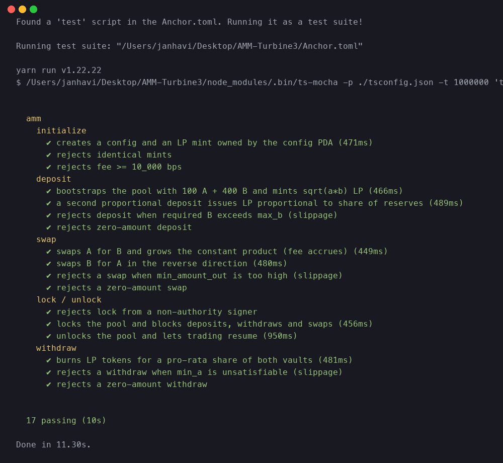

# AMM — Turbine3 Assignment 1

A constant-product Automated Market Maker (AMM) built in Anchor for the
Turbine3 Solana cohort. The program lets anyone create an `(A, B)` liquidity
pool, deposit reserves in exchange for LP tokens, swap one side for the other
at the curve price (minus a configurable fee), withdraw a pro-rata share of
the pool, and — for the optional pool authority — lock and unlock trading.

The math, accounts, instructions, and tests were all written from scratch for
this submission.

- **Web app:** <https://amm-solana.vercel.app>
- **Program (devnet):** [`4DmfmgZHzg7aTC11qaZGc7WsbiA7hjtgLU4TpePrSB3v`](https://explorer.solana.com/address/4DmfmgZHzg7aTC11qaZGc7WsbiA7hjtgLU4TpePrSB3v?cluster=devnet)
- **Source:** <https://github.com/Hijanhv/AMM-Turbine3>

## Repository layout

```
programs/amm/
  src/
    lib.rs                    program entrypoint, declares each instruction
    constants.rs              PDA seeds and the fee denominator
    error.rs                  AmmError variants
    curve.rs                  constant-product math + unit tests
    state/config.rs           the Config account
    instructions/
      initialize.rs           initialize the pool, vaults and the LP mint
      deposit.rs              add liquidity, mint LP tokens
      withdraw.rs             burn LP tokens, withdraw both sides
      swap.rs                 constant-product swap with fee
      lock.rs                 lock / unlock (authority gated)
tests/amm.ts                  integration tests against a local validator
docs/tests-passing.png        screenshot of the full passing suite
app/                          Next.js 16 frontend (deployable to Vercel)
```

## Instructions

| Instruction | What it does |
| --- | --- |
| `initialize(seed, fee_bps, authority)` | Create the `Config` PDA, the LP mint PDA, and both vault ATAs owned by the config. `fee_bps` must be `< 10_000`. |
| `deposit(amount_a, max_b, min_lp)` | Transfer `amount_a` of mint A and the matching amount of mint B (capped by `max_b`) into the vaults, mint LP. On the first deposit the LP supply is `sqrt(a * b)`; subsequent deposits mint proportional to the share of reserves added. |
| `withdraw(lp_amount, min_a, min_b)` | Burn `lp_amount` of LP tokens, return the matching pro-rata share of each vault. Honors slippage floors. |
| `swap(amount_in, min_amount_out, a_to_b)` | Constant-product swap with the configured fee, honors `min_amount_out` as a slippage floor. |
| `lock()` / `unlock()` | Authority-gated; locking blocks all `deposit`/`withdraw`/`swap` calls. |

### The curve

Given reserves `(rA, rB)` and an input `amount_in` of side `A`, the output
side `B` is:

```
amount_in_with_fee = amount_in * (FEE_DENOMINATOR - fee_bps)
amount_out         = (amount_in_with_fee * rB)
                     / (rA * FEE_DENOMINATOR + amount_in_with_fee)
```

That preserves the constant product `k = rA * rB` modulo the protocol fee,
which accrues to LPs. `FEE_DENOMINATOR` is `10_000`, so a `fee_bps` of `30`
gives the familiar 0.30% fee.

## PDAs

| PDA | Seeds |
| --- | --- |
| `Config` | `[b"config", seed.to_le_bytes()]` |
| LP mint | `[b"lp", config.key()]` |
| `vault_a`, `vault_b` | Associated token accounts of `config` for each mint |

`Config` keeps the two mints, the fee, an optional authority, the lock flag,
and both bumps so the on-chain instructions never recompute them.

## Errors

All custom errors live in `programs/amm/src/error.rs`:

`PoolLocked`, `InvalidFee`, `ZeroAmount`, `SlippageExceeded`, `Overflow`,
`EmptyReserves`, `Unauthorized`, `IdenticalMints`.

## Getting started

Prerequisites:

- Rust + Cargo (toolchain pinned by `rust-toolchain.toml`)
- Solana CLI `>= 1.18`
- Anchor `0.32.1`
- Node 18+ and `yarn`

Install JS deps and build the program:

```bash
yarn install
anchor build
```

## Running the tests

```bash
anchor test
```

`anchor test` boots a local validator, deploys the program, and runs the
TypeScript suite in `tests/amm.ts`. The suite covers every instruction —
both the happy path and the error paths (slippage, zero amounts, identical
mints, oversized fees, unauthorized lock, swaps against a locked pool, etc.).

Pure-Rust curve tests can be run on their own:

```bash
cargo test --manifest-path programs/amm/Cargo.toml --lib
```

### Tests passing



The raw mocha output is captured in `docs/test-output.txt`.

## Deployment

This is a regular Anchor program, so it deploys to any Solana cluster via
`anchor deploy`. The shipped program ID is the keypair in
`target/deploy/amm-keypair.json` (`4DmfmgZHzg7aTC11qaZGc7WsbiA7hjtgLU4TpePrSB3v`).
If you fork the repo, generate a fresh keypair and rewrite the ID in
`programs/amm/src/lib.rs` (`declare_id!`) and `Anchor.toml` before deploying.

### Live on devnet

The program is already deployed:

| | |
| --- | --- |
| Program ID | [`4DmfmgZHzg7aTC11qaZGc7WsbiA7hjtgLU4TpePrSB3v`](https://explorer.solana.com/address/4DmfmgZHzg7aTC11qaZGc7WsbiA7hjtgLU4TpePrSB3v?cluster=devnet) |
| Cluster | Devnet |
| Upgrade authority | `R4yWvKDEjbdzXEmn5sNpEwaHSHbvodeUXm5u2gwMAko` |
| Deploy tx | [`3A1bt6nHsRju81HDQCvW5ffCwiCtrptWvYg1sWqBhYtN8CqvAH6sUKzjBTKjCbrzShyCRdrShqBsHH5yGs6dNVo3`](https://explorer.solana.com/tx/3A1bt6nHsRju81HDQCvW5ffCwiCtrptWvYg1sWqBhYtN8CqvAH6sUKzjBTKjCbrzShyCRdrShqBsHH5yGs6dNVo3?cluster=devnet) |
| IDL account | `HGPLgFHhyHZbVQLSkJV9mR7c9JUhLTcwWyoGrFeNad9g` |

### Localnet

`anchor test` already does this on every run — it spins up
`solana-test-validator`, deploys the program, then runs the TS suite. To keep
the validator alive after the tests so you can poke at the pool from a script
or the CLI:

```bash
anchor test --detach
```

### Devnet

```bash
# 1. Point the Solana CLI at devnet and fund the deploy keypair
solana config set --url https://api.devnet.solana.com
solana airdrop 2

# 2. Build, then deploy
anchor build
anchor deploy --provider.cluster devnet
```

The deploy cost is roughly `~3 SOL` of rent (the rent is refundable on
`solana program close`). Airdrops on devnet are capped at 2 SOL per request,
so you may need a couple of attempts or a faucet such as
<https://faucet.solana.com> to top up.

### Mainnet

Same flow as devnet, but point at a mainnet RPC and pre-fund the deploy
keypair with real SOL:

```bash
anchor deploy --provider.cluster mainnet
```

Once deployed, the same TypeScript client in `tests/amm.ts` works against any
cluster — set `ANCHOR_PROVIDER_URL` and `ANCHOR_WALLET` to match the target.

### Frontend on Vercel

The on-chain program already lives on devnet — that part can't go on
Vercel (it's a BPF binary that runs on Solana validators, not Node/edge).
What *does* go on Vercel is the **web UI** in [`app/`](./app), a Next.js 16
app that:

- Connects Phantom or Solflare via `@solana/wallet-adapter-react`.
- Builds an Anchor `Program` from `target/idl/amm.json` against
  `4DmfmgZHzg7aTC11qaZGc7WsbiA7hjtgLU4TpePrSB3v`.
- Exposes forms for `initialize`, `deposit`, `swap`, `withdraw`, and the
  authority-only `lock` / `unlock` flows, plus a live pool-state panel.

Live deployment: <https://amm-solana.vercel.app>.

#### Run it locally

```bash
cd app
yarn install
yarn dev
# open http://localhost:3000
```

You'll need a Solana wallet extension (Phantom or Solflare) set to **devnet**
and an existing pair of SPL token mints to initialize a pool against. Create
test mints with the CLI if you don't have any:

```bash
spl-token --url devnet create-token
spl-token --url devnet create-account <MINT>
spl-token --url devnet mint <MINT> 1000000
```

#### Deploy to Vercel

From the dashboard:

1. Push this repo to GitHub.
2. On Vercel, **New Project → Import** the repo.
3. Set **Root Directory** to `app`. The framework is auto-detected as
   Next.js.
4. Optional: in **Environment Variables** add
   - `NEXT_PUBLIC_RPC_URL` — your preferred devnet RPC (defaults to
     `clusterApiUrl("devnet")`)
   - `NEXT_PUBLIC_PROGRAM_ID` — only if you redeployed the program with a
     different ID
5. **Deploy**.

From the CLI (what this repo was deployed with):

```bash
cd app
vercel link --project amm-solana --yes
vercel deploy --prod --yes
```

The frontend is a static + client-rendered Next.js app, so the Vercel free
tier covers it. Pushes to `main` auto-redeploy once the GitHub integration
is wired up.

#### Gotchas worth knowing

- **`@types/bn.js` must live in `app/`'s devDependencies.** Vercel doesn't
  see the repo-root `package.json`, so types installed only at the root
  break the production typecheck.
- **TS target must be `ES2020` or newer** — `bn.js` and Solana web3 ship
  `BigInt` literals. The default `ES2017` from `create-next-app` fails to
  compile.
- **Tailwind v4 reserves `@utility` for plain names** — `@utility input:focus`
  is invalid. Define focus rules as regular CSS in `globals.css`.

## Notes on the design

- The vault token accounts are created up-front in `initialize`, so the rest
  of the instructions only need `mut` access — no `init_if_needed` on hot
  paths.
- Token transfers use `transfer_checked` via `anchor_spl::token_interface`,
  which works for both Token and Token-2022 mints.
- The LP mint authority is the `Config` PDA itself; the program signs
  `mint_to` / `transfer_checked` with the config seeds.
- Accounts that hold `InterfaceAccount` / `Mint` are `Box`ed inside each
  context so the BPF stack stays under the 4 KiB limit.
